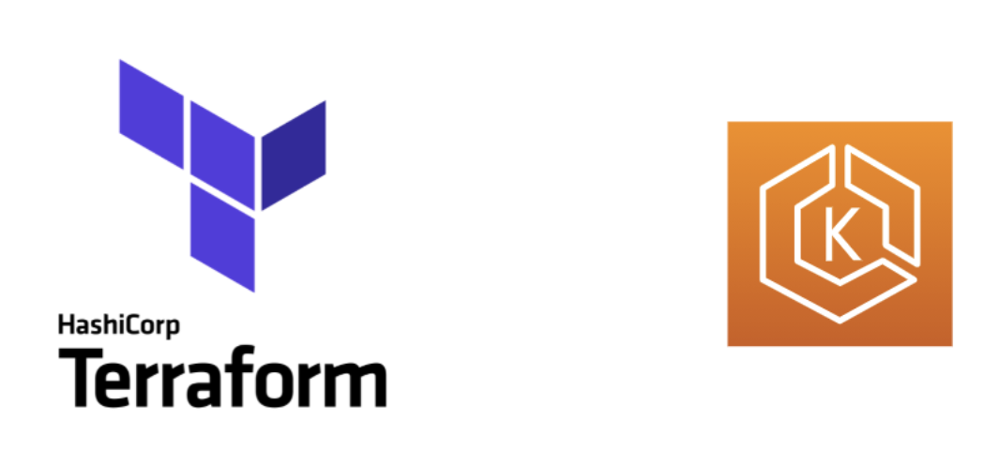

<div align="center" id="top"> 
  

  &#xa0;

</div>

<h1 align="center">Cluster EKS Usando Terraform</h1>

<p align="center">
  

  

  
</p>

<p align="center">
  <a href="#dart-sobre">Sobre</a> &#xa0; | &#xa0; 
  <a href="#rocket-tecnologias">Tecnologias</a> &#xa0; | &#xa0;
  <a href="#white_check_mark-como-usar">Como Usar</a> &#xa0; | &#xa0;
  <a href="#books-padr%C3%B5es-de-commits">Padrões de Commits</a> &#xa0; | &#xa0;
  <a href="https://github.com/Pedrinhonitz" target="_blank">Autor</a>
</p>

<br>

## :dart: Sobre ##

Este repositório contém um projeto para criação de um cluster Kubernetes (EKS) utilizando Terraform. O projeto inclui a configuração de uma VPC personalizada, o provisionamento do cluster EKS, criação de Node Groups (grupos de nós) e a configuração de um Load Balancer para balanceamento de carga. Ideal para automação e gerenciamento de infraestrutura em nuvem na AWS.

## :rocket: Tecnologias ##

As seguintes ferramentas foram utilizadas neste projeto:

- [Terraform](https://www.terraform.io/)
- [AWS](https://aws.amazon.com/pt/)
- [Kubernetes](https://kubernetes.io/pt-br/)
- [Pre Commit](https://pre-commit.com/)

## :white_check_mark: Como Usar ##
```bash
# Clone
$ git clone https://github.com/Pedrinhonitz/terraform-aws-eks-cluster.git

# Entrando na Pasta
$ cd terraform-aws-eks-cluster

# Abrindo no VScode
$ code .
```

## :books: Padrões de Commits ##

<table>
  <thead>
    <tr>
      <th>Tipo de commit</th>
      <th>Emojis</th>
      <th>Palavra-chave</th>
    </tr>
  </thead>
 <tbody>
    <tr>
      <td>Correção</td>
      <td>🐛 <code>:bug:</code></td>
      <td><code>fix</code></td>
    </tr>
    <tr>
      <td>Documentação</td>
      <td>📚 <code>:books:</code></td>
      <td><code>docs</code></td>
    </tr>
    <tr>
      <td>Estrutura do Projeto</td>
      <td>🧱 <code>:bricks:</code></td>
      <td><code>ci</code></td>
    </tr>
    <tr>
      <td>Novo recurso</td>
      <td>✨ <code>:sparkles:</code></td>
      <td><code>feat</code></td>
    </tr>
    <tr>
      <td>Testes</td>
      <td>🧪 <code>:test_tube:</code></td>
      <td><code>test</code></td>
    </tr>
  </tbody>
</table>


#
Feito por <a href="https://github.com/Pedrinhonitz" target="_blank">Pedrinhonitz</a>

<a href="#top">Voltar ao topo</a>